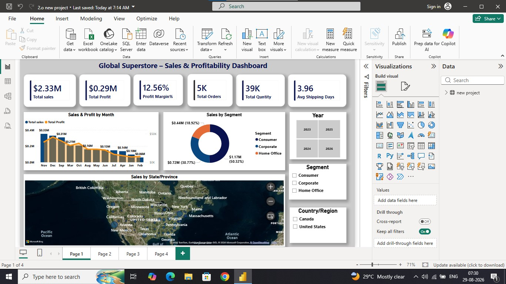
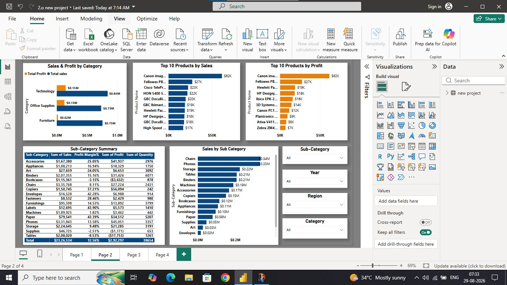
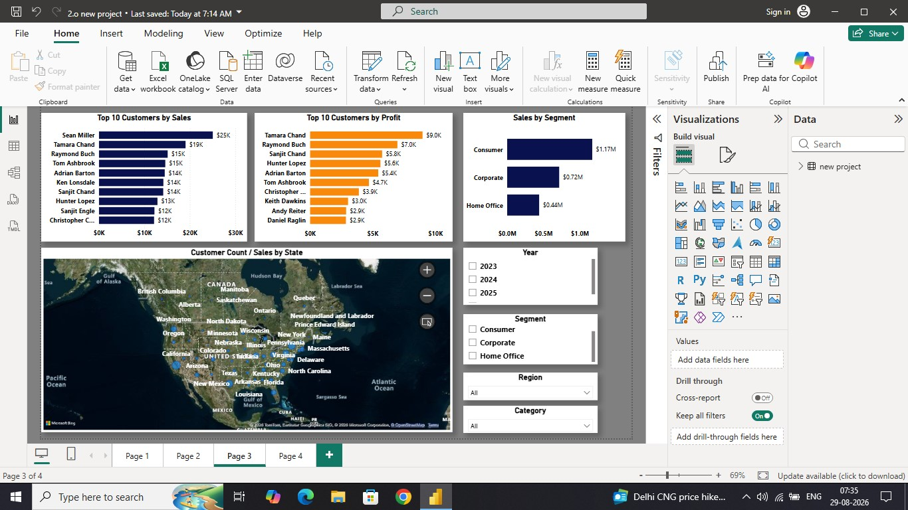
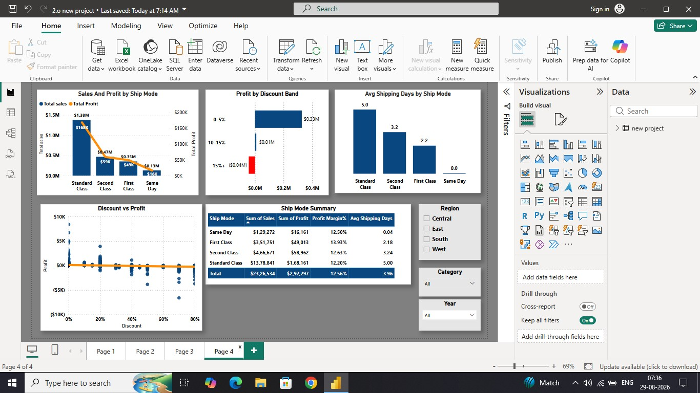

# Global-Superstore-PowerBI-Analysis
Global Superstore Sales &amp; Profitability Analysis using Power BI
# Global Superstore Power BI Analysis

## 📊 Project Overview

This project analyzes Global Superstore sales and profitability data using Microsoft Power BI.

The dashboard provides insights into sales performance, profitability, customers, products, categories, segments, shipping modes, and discounts.

## 🛠️ Tools & Technologies

- Microsoft Power BI
- Power Query
- DAX
- Data Cleaning
- Data Visualization
- Business Analysis

## 📌 Key KPIs

- Total Sales: $2.33M
- Total Profit: $0.29M
- Profit Margin: 12.56%
- Total Orders: 5K
- Total Quantity: 39K
- Average Shipping Days: 3.96

## 📈 Dashboard Analysis

### Page 1 – Sales & Profitability Overview
- Monthly Sales & Profit
- Sales by Segment
- Sales by State/Province
- Year and Segment filters

### Page 2 – Product & Category Performance
- Sales & Profit by Category
- Top 10 Products by Sales
- Top 10 Products by Profit
- Sub-Category Performance

### Page 3 – Customer & Regional Analysis
- Top 10 Customers by Sales
- Top 10 Customers by Profit
- Sales by Segment
- State-wise Customer Analysis

### Page 4 – Shipping & Discount Analysis
- Sales & Profit by Ship Mode
- Profit by Discount Band
- Average Shipping Days
- Discount vs Profit Analysis

## 🔍 Key Insights

- Consumer segment contributes the highest sales.
- Technology is the highest-selling category.
- Standard Class has the highest sales among shipping modes.
- Higher discounts can negatively affect profitability.
- Product and customer performance varies significantly across categories and regions.

## 📷 Dashboard Screenshots

### Page 1

### Page 2

### Page 3

### Page 4

## 🎯 Project Objective

The objective of this project is to transform raw sales data into an interactive dashboard and generate meaningful business insights to support data-driven decision making.

## 👨‍💻 Skills Demonstrated

Power BI | DAX | Power Query | Data Cleaning | Data Visualization | Business Intelligence | Data Analysis
